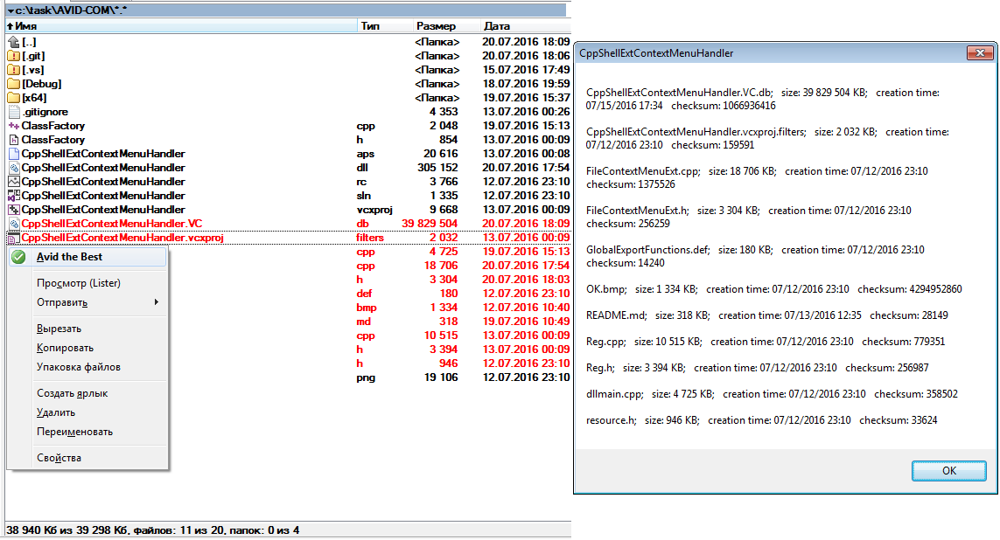

# AVID-COM
COM extension for Shell. Explorer context menu - several files can be selected, file info is displayed

instructions to install:
1) run "regsvr32 'pathTo'\CppShellExtContextMenuHandler.dll"

instructions to uninstall:
1) run "regsvr32 /u 'pathTo'\CppShellExtContextMenuHandler.dll"

